# PizzaGiro

## Auftakt in Bozen | 1\. Juni 2014

Auftakt des PizzaGiro in Bozen, Kalibrierungspizza bei nussbaumer, Pizza Margherita mit Prosciutto Cotto im muflone rosa.

<https://www.youtube.com/watch?v=UyABLWjjGXg> 

Die erste Etappe des PizzaGiro in Bozen. Nachdem die Bozner Zielpizzeria [Muflone Rosa](https://plus.google.com/101417088472218693904/about?gl=at&hl=en) keinen Tisch mehr anbieten konnte - offenbar wurde sie gewarnt -, setzte ich auf eine Kalibrierungspizza. Im [nussbaumer](http://www.vinum.it/Gastronomie-Lokale/nussbaumer.html) begrüßte ich Italien mit einer _cru-zola_ (proscuitto crudo + gorgonzola). Der perfekte Einstieg, um den Gaumen hochzufahren und einen ersten Geschmacksanker zu werfen.

Danach wurde aus der Muflone Rosa mit Improvisationskraft eine _margharita con proscuitto cotto_ mitgenommen. Diese Pizza hat mir ein völlig unbekanntes Stück im Pizza-Kosmos offenbart. Pizza aus einem ganz anderen Blickwinkel: die Flammen in Teig gebrannt - Apulien Style. Eine erste Bestätigung für die Mission des PizzaGiro und Ansporn für das, was folgen wird.

[Die Übersichtskarte des Giro](https://mapsengine.google.com/map/edit?mid=zLTl1OwaLcWA.kO5dZbHqmECk).

[Bewertungen](https://docs.google.com/spreadsheets/d/1nJDMmr8qeW6X0n13t-sRvPXcfXNC589JQmiwaUws5mM/edit?usp=sharing) (Schulnotenskala 1-5)

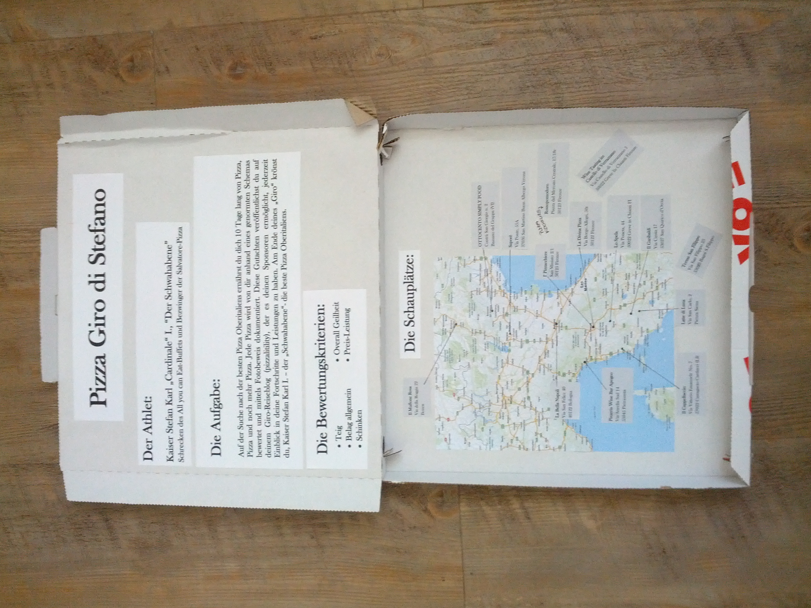 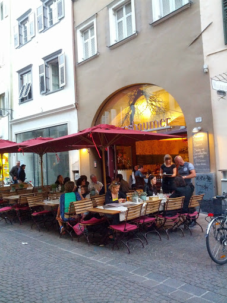 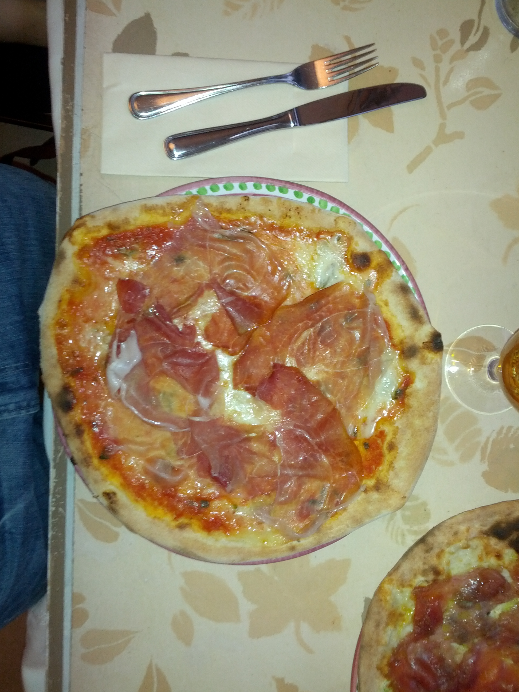 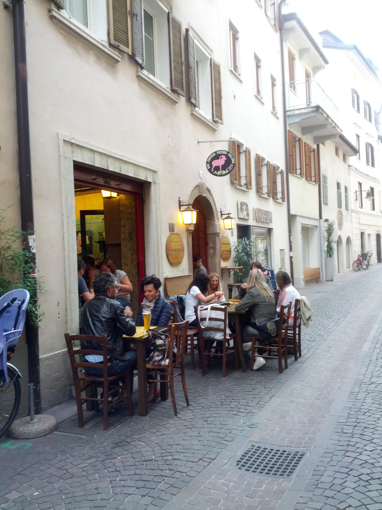 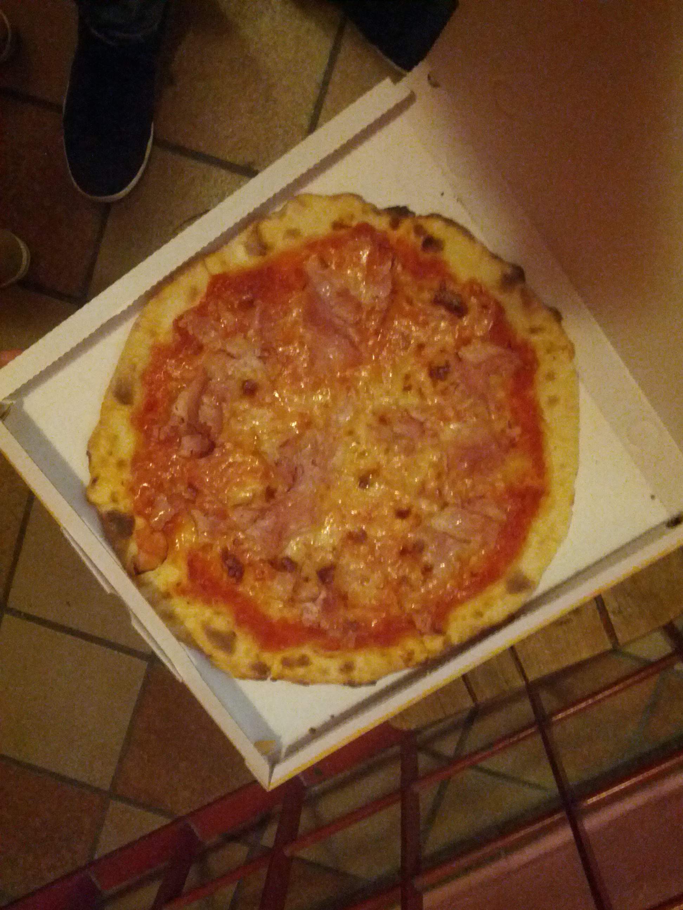

## Bring it on | 3\. Juni 2014

Der PizzaGiro geht in die nächste Runde. Verona, Bologna und Florenz hinterließen einen wohlgefälligen Nachgeschmack auf der größten Pizzaverkostungsreise seit Marco Polo.

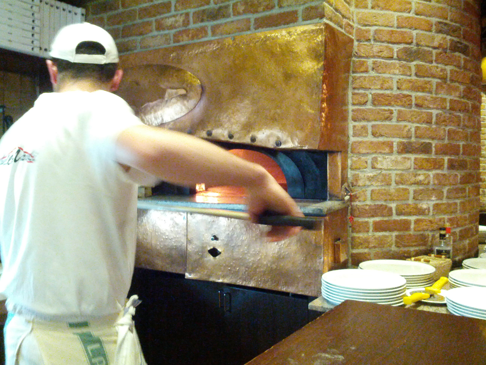

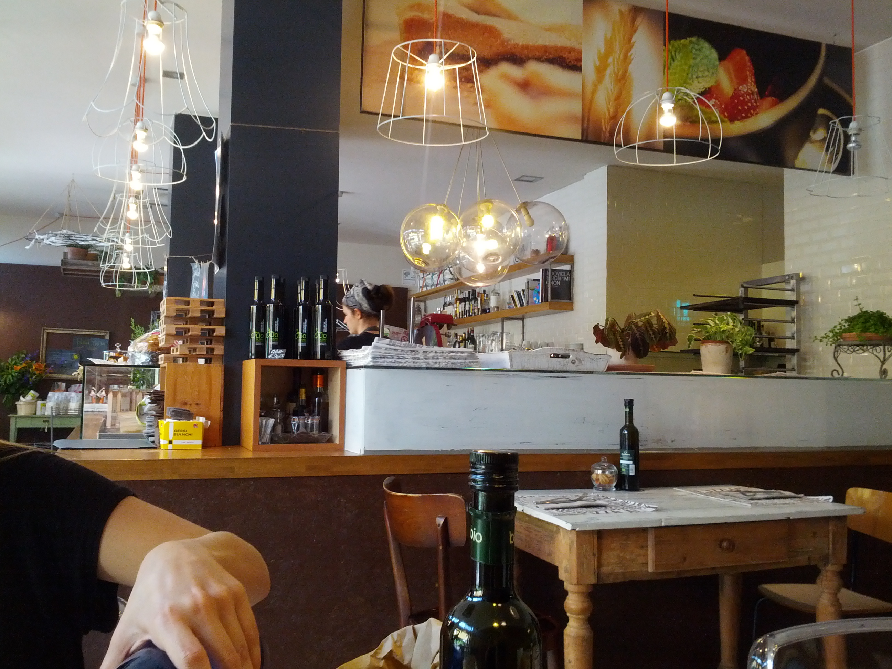

Hoi! Die Pizze fliegen. [Nach Bozen](#PizzaGiro -- Auftakt in Bozen) folgte Verona und Bologna. Außergewöhnliches kam auf den Teller. Zuerst im [Saporė](http://www.saporeverona.it/) - Kreativpizza a la Veronese -, ein Geheimtipp, hier entsteht die Pizza von Morgen, außerhalb von Verona aber ganz vorne in der Pizzavantgarde. Offenbar zu Mittag nicht die volle Pizzapraesenz. Ein Wiederkommen ist vorprogrammiert.

Dann Bologna, genauer [la bella Napoli](http://www.labellanapoli.it/). Ob Bologna oder Neapel zu danken ist, ist egal. Diese Pizza lebt. Besonders hervorzuheben: Der Prosciutto. Der gute Prousciutto-Lieferant ist sogar extra auf der Speisekarte vermerkt. Ein Besuch hinter den Kulissen hat die nächste mögliche Geheimwaffe des la bella Napoli offenbart: der Pizzaofen mit Drehscheibe. Trotzdem bin ich überzeugt, es geht noch exquisiter. Mein feiner Gaumen vermisste das Unverwechselbare, das Wow, den Gusto impossibile.

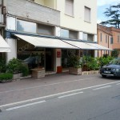

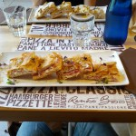

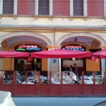

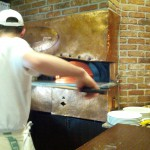

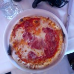

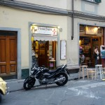

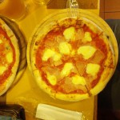

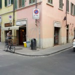

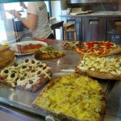

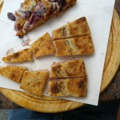

Firenze! Wie im Film. In einer kleinen Pizzaspelunke namens [Pizzacchiere](http://www.pizzacchiere.com/) mit 5 Tischen, Plastikbesteck und einem Bagno, dessen Besuch durch die Pizzaküche führt, steckt ein Pizzajuwel. Verdammt gute Pizza für wenig Geld. Teiglich sehr luftig aufgestellt, sehr saftig und trotzdem bissig. Hier sollte der Pizzaiolo noch mehr an der Harmonie der einzelnen hochklassigen Zutaten arbeiten. Dann komme ich wieder und vergebe eine leidenschaftliche 1 in Overall-Geilheit.

Firenze die Zweite. Hier kann ich mich kurz halten. [La Divina Pizza](http://www.ladivinapizza.it/) ist ein modernes Pizzastandl mit außergewöhnlichen und gut gemachten Kreationen auf Pizza-Basis. Doch der geschulte Pizza-Biss erkennt sofort, dass hier eher der Magen als der Gaumen im Vordergrund steht. Mit meiner Mission hatte es wenig zu tu, aber dennoch eine angenehme Erfahrung.

Nachdem das Rossopomodoro in Florenz sich meiner Bewertung nicht mehr stellen konnte/wollte, geht es morgen weiter in den Süden.

[Die Übersichtskarte des Giro](https://mapsengine.google.com/map/edit?mid=zLTl1OwaLcWA.kO5dZbHqmECk).

[Bewertungen](https://docs.google.com/spreadsheets/d/1nJDMmr8qeW6X0n13t-sRvPXcfXNC589JQmiwaUws5mM/edit?usp=sharing) (Schulnotenskala 1-5)

## Endstazione | 12\. Juni 2014

Der Endbericht zum PizzaGiro: 12 Pizzen in 11 Tagen. Die perfekte Pizza war nicht darunter. Nur ein Grund um weiterzumachen.

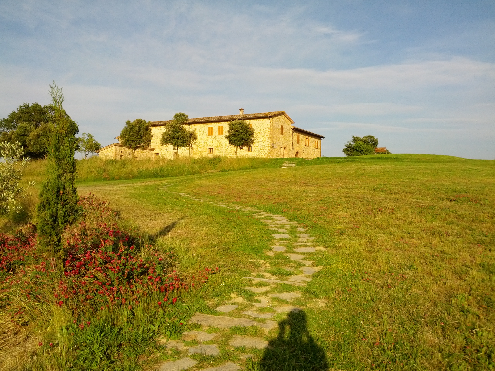

Noch abenteurlicher, noch entschlossener führte ich den PizzaGiro bis an den Süden der Toskana und schließlich zurück in den hohen Norden. Die Ereignisse überschlugen sich und Unvorhergesehenes gefährdete den Weg in den Pizza Olymp. Doch der Reihe nach:

In Anschluss an [den Auftakt](http://digit.alitility.com/gastronomicalitility/pizzagiro-auftakt-in-bozen/ "#PizzaGiro -- Auftakt in Bozen") und [der Fortsetzung](http://digit.alitility.com/gastronomicalitility/pizzagiro-bring-it-on/ "#PizzaGiro -- Bring it on") ging es nach Barberino - so lange wie es braucht den Namen auszusprechen, so lange dauert auch die Durchfahrt. Noch nie war der Schmerz über das Fehlen einer Atmosphäre-Bewertung größer als im [L'Archibugio S.N.C.](https://plus.google.com/116010301172668321918/about?gl=at&hl=en) - ein sagenhafter Blick über die Toskana auf der Terrasse. Leider hatte ich den Eindruck, dass sich die Pizza hinter dieser Szenarie verstecken will. Gewissenhaft zubereitet, doch der Teig spröde und leblos. Hier muss mehr möglich sein! Auch eine zweite unverzügliche Kostprobe, dieses Mal eher "extravaganza" mit Pecorino, bestätigte meinem Gewissen nur, was mein Gaumen längst erkannt hatte: Overall-Geilheit 3.

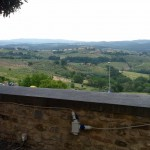

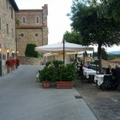

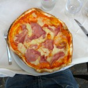

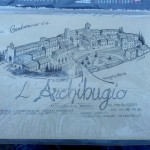

Der nächster Tag bot die bisher bitterste Enttäuschung, zuminderst zweitbitterste. Nach einer engagierten Fahrt in den Norden, fast zurück nach Florenz, teilte uns die [Lo Spela Di Pannacci Paolo](http://www.lospela.it/) Mannschaft in Il Ferrone mit, dass sie zu Mittag geschlossen hätten. Meine kritische Anmerkung, warum das Lokal dann überhaupt geöffnet hätte, verhallte - was zugegeben auch am Italienisch liegen mag. Plan B trat in Kraft: Wein. Unter der Gewissheit mit der Doppelpizza des Vortages durchhalten zu können, gönnte sich das #PizzaGiro Team eine fürstliche Bewirtung im [Castello di Verrazano](http://www.verrazzano.com/en/). Hier enden allerdings die Aufzeichnungen des Tages.

Im [Il Garibaldi](http://www.ilgaribaldisanquirico.it/) in San Quirico d'Orcia weiter im Süden der Toskana stieß ich auf ein ähnliches Phänomen: keine Pizza zu Mittag. Noch Schrecklicheres widerfuhr mir im [Latte di Luna](http://www.verrazzano.com/en/) in Pienza: überhaupt keine Pizza! Ein schwerer Schlag für die Leitung des PizzaGiro sowie für das gesamte Team. Nachträglich betrachtet war es wohl ein Fehler, die Liste der Pizzerien vorab zu veröffentlichen und die Pizzaiolos indirekt zu warnen. Durch eine virtuose Planänderung und mentale Stärke konnte der #PizzaGiro dennoch fortgesetzt werden. Il Garibald bekam noch einen Besuch, sehr zur Überraschung des Personals. Die Qualität der Pizza war für eine wirtschaftliche Symbiose aus Tankstelle und Pizzeria überraschend gut, doch zu wenig um einen bleibenden Eindruck zu hinterlassen.

Im [Il Cappellacio](http://www.ilcappellaccio.com/) in Castagneto Carducci, nahe an der Küste, servierte man mir eine riesige Pizza. Ich kenne großen Pizzen, aber diese war der Gipfel. Der interessierte Leser sei auf das Fotomaterial verwiesen. Ob Panoramablick oder Durchmessermaximierung, die Qualität einer Pizza bleibt davon unberührt. So war es auch hier leicht zu erschmecken: weniger wäre mehr gewesen. Belag geschmacklos, Schinken skandalös fad.

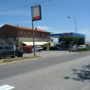

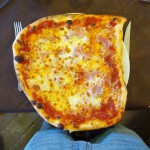

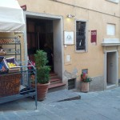

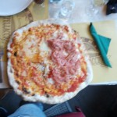

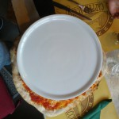

Schinken ist gleichzeitig das Stichwort der nächsten Stazione. Zu Gast im Schinkenmekka Parma bei [Don Alfonso](http://www.ristorantedonalfonso.com/). Eine Freude in Don Alfonsos Werk reinzubeißen: saftig, konkret, geschmackvoll. Eine der besten bisher. Im [Al Paradiso](http://www.vicenza.com/vetrina/al-paradiso) ein ähnlich hochwertiges Ergebnis der Pizzakultur. Hier ist eine Bestnote in absoluter Reichweite. Das Einzige, was ich kritisch anmerken muss und zum Punktabzug führte, ist der zu lang gebackene Pizzateig. Al Paradiso steht unter Beobachtung!

Kurz vor der Rückkehr in ein normales Leben, vor dem Brennerpass noch die Henkersmahlzeit im [Hubertushof](http://www.hotel-hubertushof.it/) in Sterzing. Der Pizzaäquator schien allerdings bereits überschritten. Oregano verwässerte den klassischen Pizzageschmack und dem Pizzateig fehlte jeglicher Esprit.

Der #PizzaGiro 2014 ging am 10.06.2014 zu Ende. Doch Pizzaofen aus heißt es für mich erst, wenn die perfekte Pizza gefunden und gänzlich verspeist wurde.

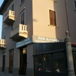

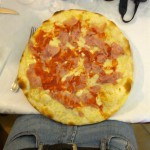

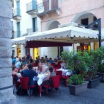

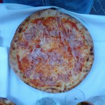

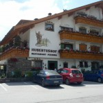

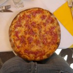

## Zur Dokumentation

- [Die Übersichtskarte des Giro](https://mapsengine.google.com/map/edit?mid=zLTl1OwaLcWA.kO5dZbHqmECk) - Der Plan
- [Bewertungen](https://docs.google.com/spreadsheets/d/1nJDMmr8qeW6X0n13t-sRvPXcfXNC589JQmiwaUws5mM/edit?usp=sharing) (Schulnotenskala 1-5)
